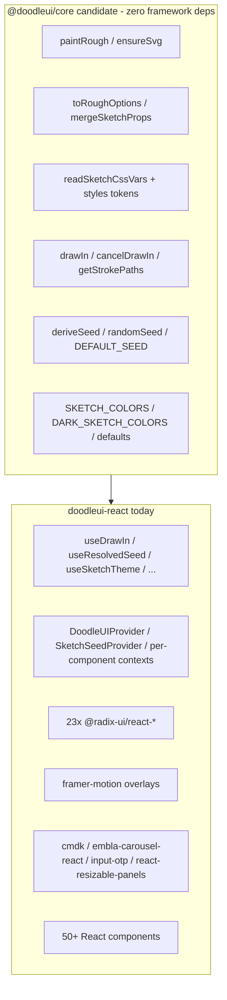

# Framework Port Feasibility — Vue / Svelte (Phase 1)

**Date:** 2026-09-18  
**Package under assessment:** `doodleui-react` @ 0.7.1  
**Decision:** **No-Go** on Vue/Svelte ports at this time  
**Scope of this document:** Demand audit, portability map, primitive parity, revisit criteria, and a future `@doodleui/core` extraction blueprint (not an implementation plan)

---

## 1. Goal

Decide whether to invest in a Vue or Svelte port of the sketch-styling engine and component library. Phase 1 is a feasibility/scoping exercise only — not a commitment to porting 50+ components.

---

## 2. Demand Signal Audit

Assessed 2026-09-18 against public GitHub and npm data.

| Signal | Observation |
|--------|-------------|
| Repo age | Created 2026-09-13 (~5 days old at assessment) |
| Stars / forks | 0 / 0 |
| Discussions | Disabled (`has_discussions: false`) |
| User issues | None open; only Changesets release PR (#2, bot) |
| Feature requests for Vue/Svelte | None found |
| npm versions | 0.1.0 → 0.7.1 (11 publishes in ~5 days) |
| npm downloads (first week window) | ~1,207 total (`last-week` API); spike days align with publish activity |

**Verdict:** Zero external demand for non-React ports. Early download volume is consistent with author/CI publish cycles, not a multi-framework audience. Starting a second (or third) framework package now would dilute solo-maintainer focus with unvalidated payoff.

---

## 3. Decision: No-Go

**Do not** scaffold `doodleui-vue` or `doodleui-svelte`, and **do not** extract `@doodleui/core` yet.

Rationale:

1. Effort-to-payoff is worse than React-focused work (docs, a11y, bugs, DX).
2. Multi-package maintenance is ongoing cost, not one-time cost.
3. The sketch core *is* extractable later; waiting does not burn the option.
4. Radix-equivalent gaps (especially Svelte) are the largest technical risk; validating demand first avoids that risk prematurely.

### Revisit criteria (any one is enough to reopen Phase 1)

- **≥10** distinct community requests (issues, discussions, Discord/social) asking for Vue and/or Svelte, **or**
- **≥10k** weekly npm downloads for `doodleui-react` sustained for 4+ weeks, **or**
- A committed co-maintainer willing to own a framework package end-to-end

Until then: stay React-only; keep this doc as the living blueprint.

---

## 4. Architecture: What Is Portable vs Not



### 4.1 Framework-agnostic (extractable to `@doodleui/core`)

| Concern | Current location | Notes |
|---------|------------------|-------|
| rough.js option mapping | `types.ts` → `toRoughOptions` | Pure; depends on `roughjs` types only |
| Prop / CSS / default merge | `hooks/useSketchDefaults.ts` → `mergeSketchProps`, `readSketchCssVars` | Drop React `useMemo`/`useContext`; keep pure functions |
| SVG paint pipeline | `primitives/RoughSvg.tsx` → `ensureSvg`, `paintRough` | Already imperative DOM; wrapper stays per-framework |
| Draw-in animation | `animations/useDrawIn.ts` → `drawIn`, `cancelDrawIn`, `getStrokePaths`, duration constants | WAAPI; hook becomes thin adapter |
| Seed math | `utils.ts` → `deriveSeed`, `randomSeed`, `DEFAULT_SEED` | Pure; strip `assignRef` (React-only) |
| Design tokens | `types.ts` color constants + `styles.css` `--doodle-ui-*` contract | CSS can ship from core; JS tokens shared |

**CSS variable contract** (must remain stable across packages):

- Sketch: `--doodle-ui-roughness`, `--doodle-ui-bowing`, `--doodle-ui-stroke-width`, `--doodle-ui-stroke-color`, `--doodle-ui-fill-style`
- Theme: `--doodle-ui-bg-color`, `--doodle-ui-text-color`, `--doodle-ui-color-{info,warning,error,success}`
- Font: `--doodle-ui-font-family`, `--doodle-ui-font`, `--doodle-ui-font-weight`

### 4.2 Not portable as-is (framework rewrite required)

| Concern | Why |
|---------|-----|
| Radix primitives (23 packages) | React-only; need Reka UI / Bits UI / Melt UI |
| Hooks + React Context | Provider / seed / theme / animate resolution |
| `RoughSvg` / `SketchBox` components | Need Vue SFC / Svelte component shells around shared paint |
| `framer-motion` overlays | Dialog, AlertDialog, Sheet, Drawer, Modal |
| `cmdk`, `embla-carousel-react`, `input-otp`, `react-resizable-panels` | React-specific; need Vue/Svelte equivalents |
| Docs playgrounds / Storybook / CLI registry | React-oriented; adapt snippets and registry later |

### 4.3 Rough component inventory (React today)

~53 component modules under `packages/doodle-ui/src/components/`, spanning:

- **Low Radix / visual-first:** Button, Card, Badge, Alert, Divider, Typography, Spinner, Skeleton, Kbd, Empty, Progress, Breadcrumb, Pagination, Table, Stepper, Field, Input, Textarea, InputGroup, NativeSelect, …
- **Radix / a11y-heavy:** Dialog, AlertDialog, Select, Tabs, Accordion, DropdownMenu, ContextMenu, Menubar, NavigationMenu, Popover, HoverCard, Tooltip, Toast, Checkbox, Radio, Switch, Slider, Toggle, ToggleGroup, ScrollArea, Avatar, Label, Collapsible, …
- **Specialized libs:** Command/Combobox (`cmdk`), Carousel (`embla`), InputOTP, Resizable, Sidebar, Drawer/Sheet/Modal

---

## 5. Framework Choice If Demand Appears

### 5.1 Vue (preferred)

| Factor | Assessment |
|--------|------------|
| Primitives | **Reka UI** (formerly Radix Vue) — broad parity with Radix React (Dialog, Select, Tabs, Accordion, menus, etc.) |
| Motion | Native `<Transition>` / CSS; less need for Framer |
| Audience | Larger than Svelte for component-library consumers |
| Risk | Confirm each needed primitive before committing; treat parity gaps as blockers |

### 5.2 Svelte

| Factor | Assessment |
|--------|------------|
| Primitives | **Bits UI** / **Melt UI** — strong but different API shape than Radix |
| Motion | Svelte transitions |
| Audience | Smaller |
| Risk | Svelte 5 runes migration / library churn; higher port friction |

**Priority if revisiting:** Vue first; Svelte only with clear demand and a maintainer familiar with Bits/Melt.

### 5.3 Primitive parity checklist (gate before scaffolding)

Before any port package ships Tier-1 beyond Button/Card/Badge, confirm the target library exposes usable equivalents for at least:

Accordion, AlertDialog, Checkbox, Collapsible, ContextMenu, Dialog, DropdownMenu, HoverCard, Label, Menubar, NavigationMenu, Popover, RadioGroup, ScrollArea, Select, Slider, Switch, Tabs, Toast, Toggle, ToggleGroup, Tooltip, Avatar, AspectRatio

Gaps here are the primary technical reason a full port can stall.

---

## 6. Future Blueprint: `@doodleui/core` (Phase 2 — deferred)

Worth doing **when** revisit criteria pass — and optionally even without a second framework (architecture cleanup only). **Not started now.**

### 6.1 Proposed package

- Name: `@doodleui/core` (or `doodleui-core` if scoped publish is undesirable)
- Location: `packages/core` in this Turborepo
- Dependencies: `roughjs` only (no React/Vue/Svelte)
- Exports (illustrative):

```ts
// sketch
export { toRoughOptions, mergeSketchProps, readSketchCssVars } from "...";
export { ensureSvg, paintRough } from "...";
export type { SketchProps, FillStyle, RoughShape, RoughPaintOptions } from "...";

// animation
export {
  drawIn,
  cancelDrawIn,
  getStrokePaths,
  DRAW_IN_DURATION_MS,
  DRAW_IN_ALERT_MS,
  DRAW_IN_TOOLTIP_MS,
  DRAW_IN_MARK_MS,
  TABLE_STAGGER_MS,
} from "...";

// seeds / tokens
export { deriveSeed, randomSeed, DEFAULT_SEED } from "...";
export {
  DEFAULT_ROUGHNESS,
  DEFAULT_BOWING,
  DEFAULT_STROKE_WIDTH,
  DEFAULT_INK,
  SKETCH_COLORS,
  DARK_SKETCH_COLORS,
} from "...";

// styles
// "./styles.css" → shared --doodle-ui-* contract
```

### 6.2 React refactor shape

1. Move pure helpers out of `RoughSvg.tsx` / `useDrawIn.ts` / `useSketchDefaults.ts` / `types.ts` / `utils.ts`.
2. Keep React hooks as thin wrappers (`useDrawIn` calls `drawIn` + `MutationObserver` as today).
3. `doodleui-react` depends on workspace `@doodleui/core`; re-export types users already import if needed for semver friendliness.
4. No public API break for consumers if re-exports are preserved.

### 6.3 Phase 3 sketch (only after go)

1. Scaffold `packages/doodle-ui-vue` (or svelte) mirroring Turborepo/tsup patterns.
2. Port order (same as original React priority): **Button → Card → Badge** → forms → overlays last.
3. Reuse docs copy structure; swap install/import snippets.
4. Publish as a **separate** package — never bundle into `doodleui-react`.

---

## 7. Explicit Non-Goals (now)

- No new package folders or workspace entries for Vue/Svelte/core
- No Radix Vue / Bits UI dependency experiments in-tree
- No dual docs site or framework switcher
- No changes to `doodleui-react` public API for this decision

---

## 8. Recommendation Summary

| Question | Answer |
|----------|--------|
| Port Vue or Svelte now? | **No** |
| Extract `@doodleui/core` now? | **No** (optional later; revisit with demand or dedicated architecture sprint) |
| Preferred framework when yes? | **Vue** (Reka UI) |
| What to do instead? | Deepen React quality, docs, adoption; watch revisit criteria |

This assessment should be updated when revisit criteria are met or when the React sketch core materially changes (e.g. rough.js replaced, CSS contract broken).
